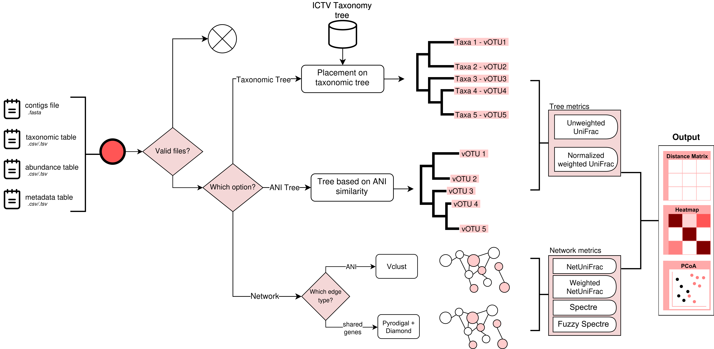
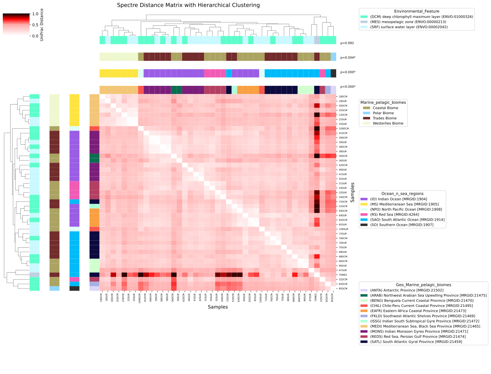
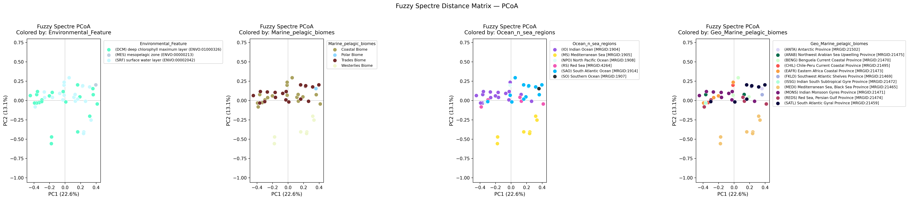

#  ViroFrac

ViroFrac is a software package for estimating distances between viral communities using genome similarity information.

## Features

### Relatedness methods
ViroFrac offers 3 approaches for establishing relationships between viral contigs:

#### Taxonomic tree

Based on a bundled ICTV taxonomic tree, this approach can calculate weighted and unweighted UniFrac distances between viral communities. For this, the tool uses a background reference tree containing all the ICTV-recognized taxa (VMR MSL40).

#### ANI tree

Using ANI scores provided by vClust (v1.3.1), this method generates an ANI UPGMA tree, in which weighted and unweighted UniFrac can be applied.

#### Network

Builds a network between contigs. Networks can be built using ANI-based distance with vClust (v1.3.1) and gene-sharing based distance with Pyrodigal (v3.7.0) and DIAMOND (v2.1.15.169).

#### Overview of ViroFrac's workflow


### Output

ViroFrac generates outputs for comprehensive analysis and visualization:

#### Matrix

Distance values are exported in a matrix output as a tabular-separated format (`matrix_as_dataframe.tsv`). This matrix can be imported into other analyticas or visualization packaged for downstream analysis.

**Format:**
```
        Sample1    Sample2    Sample3
Sample1 0.000      0.245      0.678
Sample2 0.245      0.000      0.543
Sample3 0.678      0.543      0.000
```

#### Heatmap

One of the graphical outputs provided by ViroFrac are heatmaps (`virofrac_heatmap.png` and `virofrac_heatmap.svg`). The heatmap function uses the seaborn package for visualization. A raw heatmap output by ViroFrac has the following appearence:



#### PCoA

A PCoA plot is also provided as a standard ViroFrac output. If included, an envfit vector can be drawn on the PCoA plots.



## Installation [PROVISIONALLY]

Provisionally, the code is given as follows:

1. A git clone will be needed to download all the code to a local directory:
```
git clone https://github.com/reymonera/virofrac.git
```
A ZIP download to the execution location can also do the work.

2. After downloading the code, the dependencies should be installed as follows:
```
conda env create -f virofrac-env.yml
```

Currently, ViroFrac is running based on a script.

## Usage
```
 _  _  __  ___   __  ___  ___    __   __ 
( )( )(  )(  ,) /  \(  _)(  ,)  (  ) / _)
 \\//  )(  )  \( () )) _) )  \  /__\( (_ 
 (__) (__)(_)\_)\__/(_)  (_)\_)(_)(_)\__)

Virofrac v. 1.0.0
Usage: virofrac.sh [options]

Made with elegance 🍷

General options:
  -h, --help                             Shows this helpful text :)

Input options:
  -f, --fasta [file]                     Selects FASTA file for network options [.fasta|.fna|.fa]
  -o, --otu-table [file]                 Selects OTU table [.tsv|.csv|.tab|.tabular]
  -t, --tax-table [file]                 Selects taxonomic table [.tsv|.csv|.tab|.tabular]

Distance options:
  -u, --unweighted-distance              Selects the unweighted distance option.
                                         • When paired with a tree option it will perform an unweighted UniFrac distance.
                                         • When paired with the network option it will perform an unweighted NetUniFrac distance.
  -z, --unnormalized-weighted-distance   Selects the unnormalized weighted distance option.
  -w, --normalized-weighted-distance     Selects the normalized weighted unifrac option. When paired with the network option it will perform a Weighted NetUniFrac distance.
                                         • When paired with a tree option it will perform a normalized weighted UniFrac distance.
                                         • When paired with the network option it will perform an weighted NetUniFrac distance.
  -s, --spectre                          Selects the Spectre distance (Only available with Network option)
  -y, --fuzzy-spectre                    Selects the Fuzzy Spectre distance for abundance influence on community distances (Only available with Network option)

Tree options:
  -x, --tax-tree                         Selects the taxonomic tree mode
  -i, --ani-tree [file]                  Selects the ANI tree option

Network options:
  -n, --network                          Selects network option
  -a, --ani                              Selects ANI based network option (works wth vClust)
  -g, --gene-sharing                     Selects gene-sharing based network option (works wth DIAMOND + PyRodigal)
  -b, --threshold [value]                Selects a threshold for the network-based clustering. Default: 0

Metadata/Plot options:
  -m, --metadata [file]                  A metadata file used for the final heatmap plot. If not used, it will output a default plot. [.tsv|.csv|.tab|.tabular]
  -l, --legend-column [column_name]      This will apply color strips and a legend to the final heatmap plot. Requires a specified color column.
  -c, --color-column [column_name]       If used, the script will apply the colors in the selected column. Requires a specified legend column.
                                         NOTE: Specify the legend columns and then the color columns. The script will use the corresponding order.
  -r, --color-gradient [string]          Default: 'coolwarm'. When used, user can specify another gradient or a custom gradient using hexacode
  -e, --env-column [column_name]         Environmental variable(s) for envfit projection in PCoA.

Output options:
  -d, --output-directory [directory]     Defines an output directory.

```
## Quick Start [PROVISIONALLY]
If:
- contigs file location: `tara_oceans/TOV_43_populations.fna`
- count table location: `tara_oceans/tov_population_relative_abundance.csv`
- metadata location: `tara_oceans/tov_metadata.csv`
- the metadata category to be clustered: `Geo_Marine_pelagic_biomes`
- the metadata defined color column to be used: `geo_marine_pelagic_colors`
- the wanted network structure: `ani`
- the wanted distance: `spectre`

Then:

```
bash virofrac.sh --fasta tara_oceans/TOV_43_populations.fna --otu-table tara_oceans/tov_population_relative_abundance.csv --ani --network --spectre --metadata tara_oceans/tov_metadata.csv --legend-column Geo_Marine_pelagic_biomes
```

## Documentation

## Citation
